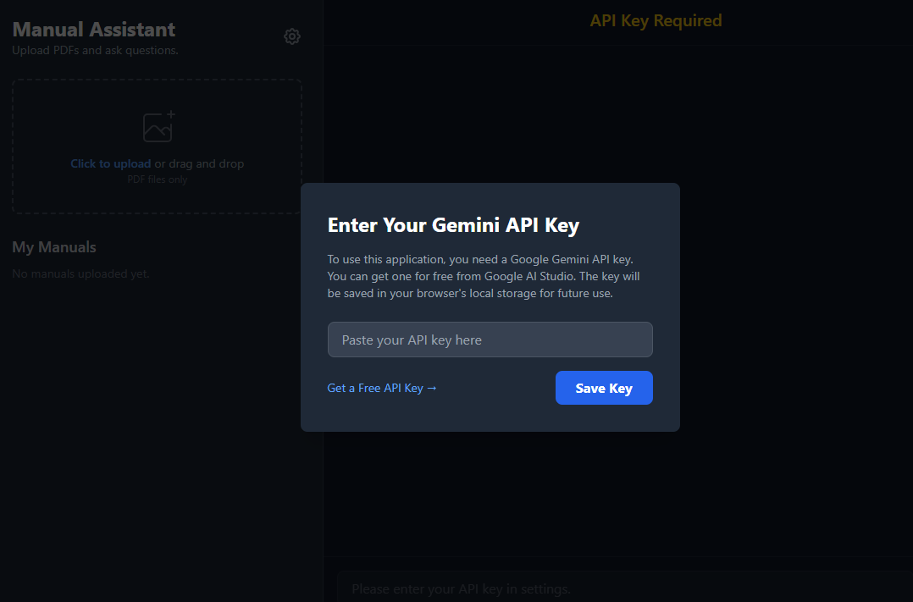
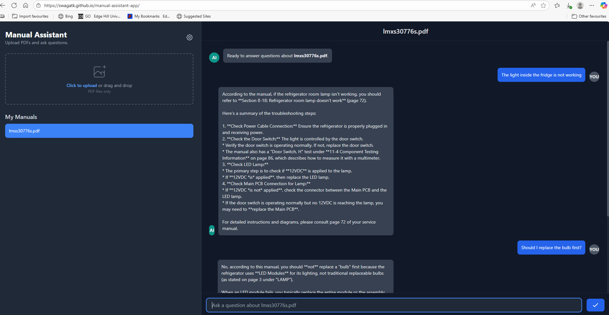

# Manual AI Assistant
An AI instant that can respond to user queries and help them carry out maintenance of an equipment. 

Steps to Use the application
- Provide a Gemini API Key which you can get from [Google AI studio](https://aistudio.google.com/prompts/new_chat). You can use a free tier api key to use this for a limited time. The key is stored temporarily. 
- Upload a manual that the AI agent should use to respond. 
- Ask questions about your faults. 

## UI Images

