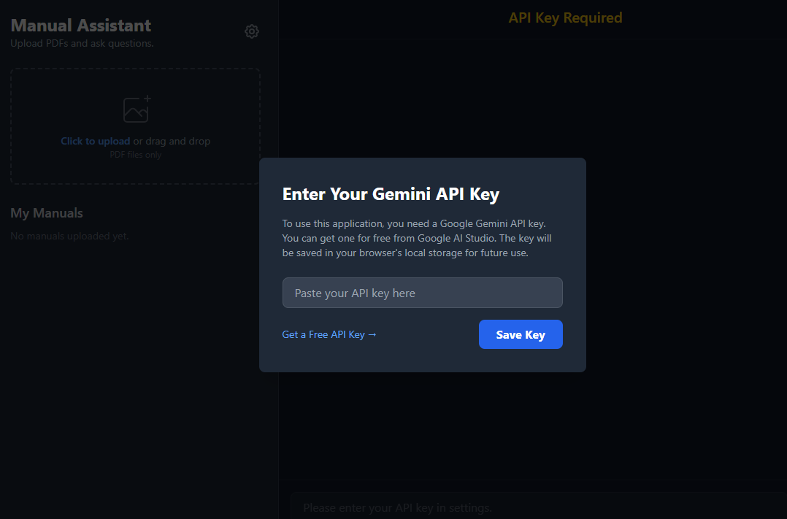
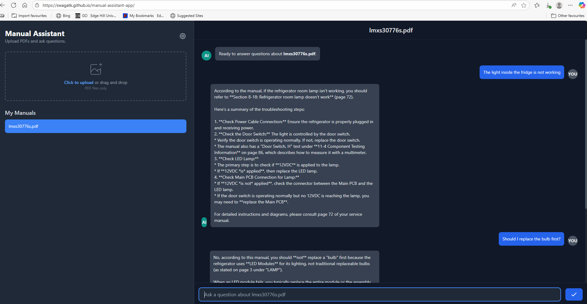
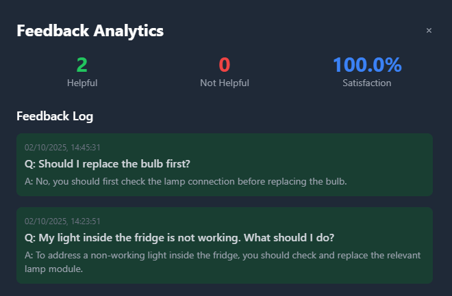
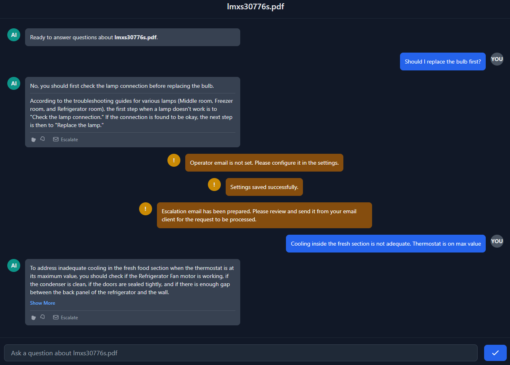

# Manual AI Assistant
An AI Assistant that can respond to user queries and help them carry out maintenance of an equipment. 

Steps to Use the application
- Provide a Gemini API Key which you can get from [Google AI studio](https://aistudio.google.com/prompts/new_chat). You can use a free tier api key to use this for a limited time. The key is stored temporarily. 
- Upload a manual that the AI agent should use to respond.  You can download a PDF manual for LG refrigerator from this [link](https://www.manualslib.com/manual/1114650/Lg-Lmxs30776s.html).
- Ask questions about your faults. 
- The application is accessible at this link: [https://swagatk.github.io/manual_assistant-app/](https://swagatk.github.io/manual_assistant-app/)

## Features implemented
- Short / long answers
- user can provide feedback by clicking on Thumbs up / Thumbs Down button
- user can escalate to the operator by sending an email. 
- Feedback analytics visualization 

## UI Images

### Settings

### Chat Interface

### Analytics

### Feedback / Escalate
